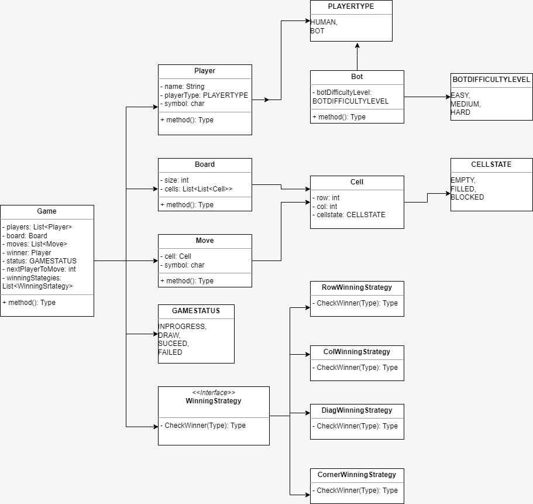

# TicTacToe

### What is TicTacToe?

TicTacToe is a 2 player game played on a 3 x 3 board. Each player is allotted a symbol (one X and one O). Initially, the board is empty. Alternatively, each player takes a turn and puts their symbol at any empty slot. The first player to get their symbol over a complete row OR a complete column OR a diagonal wins.

### Problem Requirements  
1. Board can be of any NxN size.
2. Number of players N-1. Each player will be allotted a symbol.(Two players cannot have same symbol)
3. The players can be either humans or bot(only 1 bot per game). Bot will have different difficulty levels.
4. Who will make the first move - at start of teh game we will randomize teh list, and they will play in the same order.
5. We should allow support to undo any number of moves.
6. How a winner is decided - we want to keep our game extensible so user at start of teh game can choose what all rules to apply to decide a winner.
   * All cells of one row is same.
   * All cells of one column is same.
   * All Cells of 2 diagonals are same.
   * All cells of corners are same.
7. Game ends when we have a winner, or it can be a draw. (No Play/Pause/Exit of Game).
8. Show teh replay of Game.
9. Try to implement the winner detection algorithm in O(1).

### Interaction Format
> Command Line based interactive application.

### Expectations
1. The code should be working and functionally correct
2. Good software design practices should be followed:
    * Code should be modular, readable, extensible
    * Separation of concern should be addressed
    * Project structured well across multiple files/ packages
3. Write unit testsNo need to create
4. `No need of GUI`

### Class Diagram

